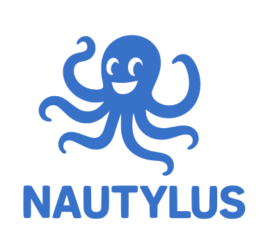

# nautylus

<p align="center">
  
</p>

Nautylus is a **single-node, embedded** graph + vector engine for
recommendation and ideation, with deterministic scoring and
explainability as first-class features.

## Quick start

Build the static library and demo CLI:

```sh
make
```

Run a demo query (in-process, in-memory):

```sh
./nautylus demo
./nautylus query --node alba --k 3
```

Launch the local demo UI:

```sh
./nautylus serve --port 6180
```

Then open `http://127.0.0.1:6180` in your browser. The UI bundles D3.js
locally from `resources/d3/d3.v7.min.js`.

## Load your own data

CSV nodes (name + vector):

```csv
alba,0.1,0.2,0.3
boreal,0.2,0.1,0.4
```

CSV edges (from,to,weight):

```csv
alba,boreal,1.0
```

Build a local store and query it:

```sh
./nautylus load --nodes nodes.csv --edges edges.csv --dim 3 --out demo.nty
./nautylus query --db demo.nty --node alba --k 3
./nautylus serve --db demo.nty
```

Store files are a simple binary snapshot for the demo flow; the format
is not stable yet.

JSON input (nodes + edges) also works:

```json
{
  "nodes": [
    {"name": "alba", "vector": [0.1, 0.2, 0.3]}
  ],
  "edges": [
    {"from": "alba", "to": "alba", "weight": 1.0}
  ]
}
```

Load JSON directly without a store:

```sh
./nautylus query --json data.json --node alba --k 3
```
